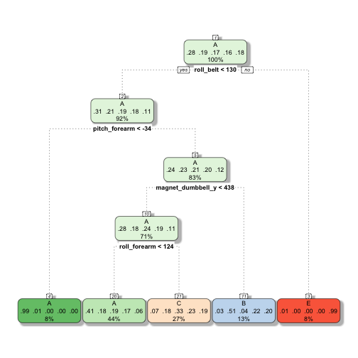

### Executive Summary
The goal of this data analysis is to predict the manner in which the user did
the exercise. The training data set contains the target variable `classe`, all 
other variables will be used to predict for it. Using cross validation, I will
find the model that best fits the data.   I started by cleaning the dataset, 
removing columns that were not related to accelerometer reading and readings 
that were dominated by NA values. This reduced the variables from 160 to 53, a 
more manageable amount. I started with a fast recursive partitioning model to 
start to see if that would produce reasonable predictions.  Unfortunately the 
estimated out of sample error for the `rpart` model was 51% and far to high.
Next I tried a random forest model with 3-fold cross validation. This model
performed really well with an estimated out of sample of only 0.7%. Using this 
model, 20 predictions will be made for the test data set.

### Load Dedepdencies

```r
library(caret)
library(rpart)
library(rattle)
library(scales)
library(randomForest)
set.seed(1337)
```


### Download and Load Data

```r
train_data_url = 'https://d396qusza40orc.cloudfront.net/predmachlearn/pml-training.csv'
test_data_url = 'https://d396qusza40orc.cloudfront.net/predmachlearn/pml-testing.csv'

if (file.exists('data/pml-training.csv') == FALSE) {
  download.file(train_data_url, 'data/pml-training.csv')
}
if (file.exists('data/pml-testing.csv') == FALSE) {
  download.file(test_data_url, 'data/pml-testing.csv')
}

pmlTrainingData <- read.csv('data/pml-training.csv', na.strings=c("","NA"))
finalTest <- read.csv('data/pml-testing.csv', na.strings=c("","NA"))
```

### Create Training & Cross Validation Datasets
The full training dataset it split into a training dataset and a testing 
dataset. The testing data will be used to cross validate our models.

```r
inTrain <- createDataPartition(pmlTrainingData$classe, p=.7, list=FALSE)
training <- pmlTrainingData[inTrain,]
testing <- pmlTrainingData[-inTrain,]

summary(training$classe)
```

```
##    A    B    C    D    E 
## 3906 2658 2396 2252 2525
```

### Clean Data
Next, time-related & recording variables and the row index variable X are 
removed because the purpose of the machine learning assignment is to use 
accelerometer reads to make predictions.

```r
training <- training[, -c(1:7)]
testing <- testing[, -c(1:7)]
finalTest <- finalTest[, -c(1:7)]
```
First, I removed variables which contained a majority of missing values. NAs and
blank fields were both marked as NA when the CSV was read.

```r
mostlyNAs <- which(colSums(is.na(training)) > nrow(training)/2)
training <- training[, -mostlyNAs]
testing <- testing[, -mostlyNAs]
finalTest <- finalTest[, -mostlyNAs]
```

## Machine Learning

### Recursive partitioning Model
Starting with a simple model 
Train the decision tree model

```r
rpModelFit <- train(classe ~ ., method="rpart", data=training)
rpModelFit$finalModel
```

```
## n= 13737 
## 
## node), split, n, loss, yval, (yprob)
##       * denotes terminal node
## 
##  1) root 13737 9831 A (0.28 0.19 0.17 0.16 0.18)  
##    2) roll_belt< 130.5 12572 8677 A (0.31 0.21 0.19 0.18 0.11)  
##      4) pitch_forearm< -33.95 1115    8 A (0.99 0.0072 0 0 0) *
##      5) pitch_forearm>=-33.95 11457 8669 A (0.24 0.23 0.21 0.2 0.12)  
##       10) magnet_dumbbell_y< 438.5 9710 6978 A (0.28 0.18 0.24 0.19 0.11)  
##         20) roll_forearm< 123.5 6069 3608 A (0.41 0.18 0.19 0.17 0.058) *
##         21) roll_forearm>=123.5 3641 2443 C (0.074 0.18 0.33 0.23 0.19) *
##       11) magnet_dumbbell_y>=438.5 1747  852 B (0.032 0.51 0.037 0.22 0.2) *
##    3) roll_belt>=130.5 1165   11 E (0.0094 0 0 0 0.99) *
```
Plot the model

```r
fancyRpartPlot(rpModelFit$finalModel, sub='')
```

 

Predict `classe` for cross validation dataset

```r
rpPreds <- predict(rpModelFit, newdata=testing)
rpConMatrix <- confusionMatrix(rpPreds, testing$classe)
rpConMatrix
```

```
## Confusion Matrix and Statistics
## 
##           Reference
## Prediction    A    B    C    D    E
##          A 1508  456  453  438  168
##          B   31  398   44  182  149
##          C  132  285  529  344  288
##          D    0    0    0    0    0
##          E    3    0    0    0  477
## 
## Overall Statistics
##                                          
##                Accuracy : 0.4948         
##                  95% CI : (0.482, 0.5077)
##     No Information Rate : 0.2845         
##     P-Value [Acc > NIR] : < 2.2e-16      
##                                          
##                   Kappa : 0.3402         
##  Mcnemar's Test P-Value : NA             
## 
## Statistics by Class:
## 
##                      Class: A Class: B Class: C Class: D Class: E
## Sensitivity            0.9008  0.34943  0.51559   0.0000  0.44085
## Specificity            0.6402  0.91445  0.78411   1.0000  0.99938
## Pos Pred Value         0.4988  0.49502  0.33523      NaN  0.99375
## Neg Pred Value         0.9420  0.85416  0.88461   0.8362  0.88807
## Prevalence             0.2845  0.19354  0.17434   0.1638  0.18386
## Detection Rate         0.2562  0.06763  0.08989   0.0000  0.08105
## Detection Prevalence   0.5137  0.13662  0.26814   0.0000  0.08156
## Balanced Accuracy      0.7705  0.63194  0.64985   0.5000  0.72011
```
Low accuracy with Recursive partitioning model

```r
rpAccuracy = rpConMatrix$overall[[1]]
percent(rpAccuracy)
```

```
## [1] "49.5%"
```
The estimated out of sample error with the cross validation dataset for this 
model is

```r
percent(1.00-rpAccuracy)
```

```
## [1] "50.5%"
```


### Random Forest Model
Random Forests should be a better learning model for our dataset.

```r
fitControl <- trainControl(method="cv", number=3, verboseIter=F)
rfModelFit <- train(classe ~., method="rf", data=training, trControl=fitControl)
rfModelFit$finalModel
```

```
## 
## Call:
##  randomForest(x = x, y = y, mtry = param$mtry) 
##                Type of random forest: classification
##                      Number of trees: 500
## No. of variables tried at each split: 2
## 
##         OOB estimate of  error rate: 0.66%
## Confusion matrix:
##      A    B    C    D    E class.error
## A 3901    3    1    0    1 0.001280082
## B   12 2640    6    0    0 0.006772009
## C    0   22 2373    1    0 0.009599332
## D    0    0   35 2215    2 0.016429840
## E    0    0    1    7 2517 0.003168317
```

Predict `classe` for cross validation dataset

```r
rfPreds <- predict(rfModelFit, newdata=testing)
rfConMatrix <- confusionMatrix(rfPreds, testing$classe)
rfConMatrix
```

```
## Confusion Matrix and Statistics
## 
##           Reference
## Prediction    A    B    C    D    E
##          A 1674    5    0    0    0
##          B    0 1130   11    0    0
##          C    0    4 1015   17    0
##          D    0    0    0  946    2
##          E    0    0    0    1 1080
## 
## Overall Statistics
##                                           
##                Accuracy : 0.9932          
##                  95% CI : (0.9908, 0.9951)
##     No Information Rate : 0.2845          
##     P-Value [Acc > NIR] : < 2.2e-16       
##                                           
##                   Kappa : 0.9914          
##  Mcnemar's Test P-Value : NA              
## 
## Statistics by Class:
## 
##                      Class: A Class: B Class: C Class: D Class: E
## Sensitivity            1.0000   0.9921   0.9893   0.9813   0.9982
## Specificity            0.9988   0.9977   0.9957   0.9996   0.9998
## Pos Pred Value         0.9970   0.9904   0.9797   0.9979   0.9991
## Neg Pred Value         1.0000   0.9981   0.9977   0.9964   0.9996
## Prevalence             0.2845   0.1935   0.1743   0.1638   0.1839
## Detection Rate         0.2845   0.1920   0.1725   0.1607   0.1835
## Detection Prevalence   0.2853   0.1939   0.1760   0.1611   0.1837
## Balanced Accuracy      0.9994   0.9949   0.9925   0.9905   0.9990
```
Much higher accuracy with a Random Forest Model

```r
rfAccuracy = rfConMatrix$overall[[1]]
percent(rfAccuracy)
```

```
## [1] "99.3%"
```
The estimated out of sample error with the cross validation dataset for this 
model is

```r
percent(1.00-rfAccuracy)
```

```
## [1] "0.68%"
```

### Conclusion
The Random Forest model outperformed the the Recursive partitioning model by 
quite a bit.  The random forest model was selected for final submissions of the 
project.


```r
submissionPreds <- predict(rfModelFit, newdata=finalTest)
submissionPreds
```

```
##  [1] B A B A A E D B A A B C B A E E A B B B
## Levels: A B C D E
```
